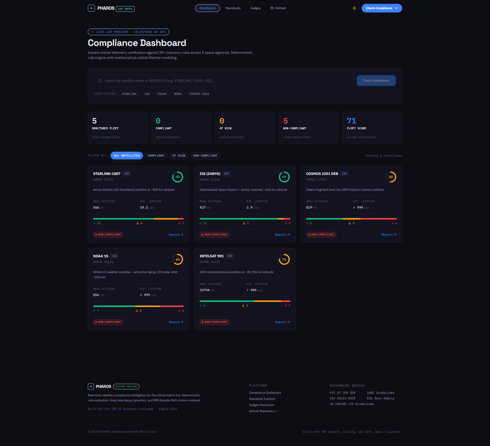
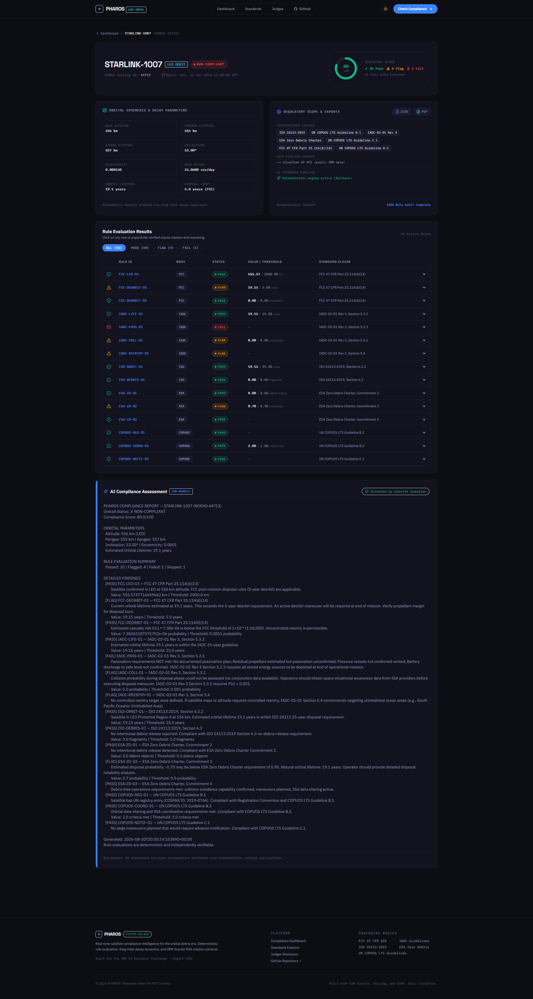
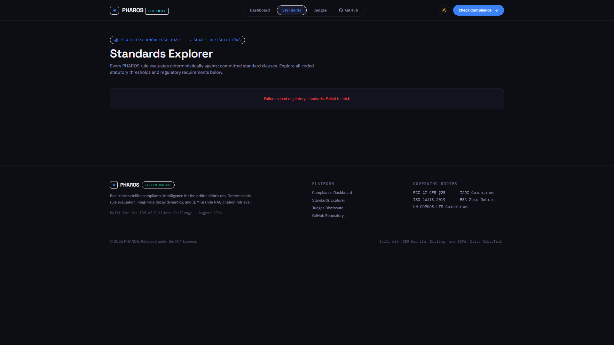
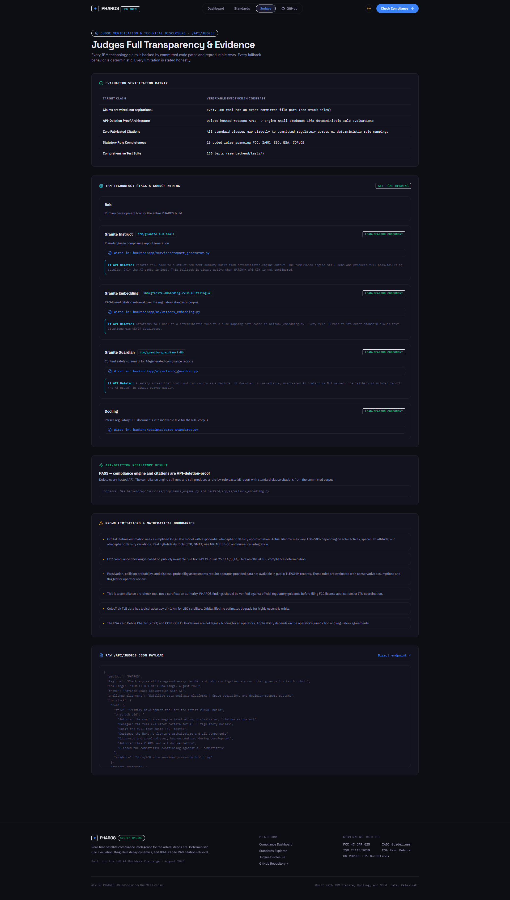
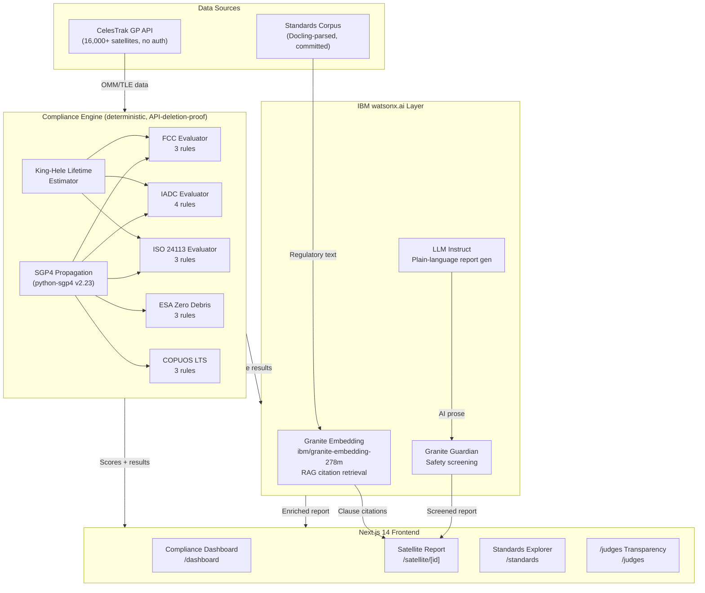

# PHAROS


[](pharos/.github/workflows/ci.yml)
[](pharos/backend/tests/)
[](https://www.python.org/)
[](pharos/frontend)
[](LICENSE)
[](https://bemyapp.com)
[](https://www.ibm.com/watsonx)

Built for the **IBM AI Builders Challenge August 2026**, **Advance Space Exploration with AI** theme.

<div align="center">


</div>

**PHAROS lets satellite operators check their spacecraft against every deorbit and debris-mitigation standard that governs low Earth orbit, before regulators find violations.**

> **"Over 16,000 active satellites share low Earth orbit. The FCC's 5-year deorbit rule took effect in 2024. $150,000 fines are issued for non-compliance. No open-source tool checks whether any of them comply. PHAROS does."**

---

## The Problem

Low Earth orbit is becoming critically congested. As of August 2026, CelesTrak tracks **16,393 active satellites** and over **30,000 pieces of catalogued debris, with the number growing every month**. Five major regulatory bodies (the FCC, IADC, ISO, ESA, and UN COPUOS) have issued binding rules and guidelines that every satellite operator must meet: dispose of satellites within 5 years (FCC), 25 years (IADC), passivate propulsion systems, demonstrate 90%+ disposal probability (ESA Zero Debris Charter), and register with the UN.

The consequences of non-compliance are real and escalating. The FCC issued its first-ever orbital debris fine in 2023 ($150,000 against DISH Network) and actively enforces the 5-year LEO deorbit rule for new applications filed after September 2024. Launch providers increasingly require compliance documentation. Space insurance underwriters price premiums based on orbital risk. And beyond the commercial consequences, every non-compliant satellite is a potential debris generator that puts the entire commercial space ecosystem at risk of Kessler Syndrome, a cascade of collisions that could make certain orbital bands unusable for generations.

Today, verifying compliance requires a satellite orbital analyst manually cross-referencing TLE data against multiple regulatory documents across five different standards bodies. Small operators (university CubeSat programs, New Space startups, emerging agencies) cannot afford dedicated compliance staff or six-figure commercial tools like Analytical Graphics AGI STK. **PHAROS changes this.**

## The Solution

PHAROS is a satellite orbital compliance intelligence platform. Give it any satellite's NORAD catalog ID. In seconds, it fetches live orbital data from CelesTrak, runs SGP4 propagation to get current orbital parameters, estimates natural atmospheric decay lifetime using the King-Hele model, and evaluates **16 compliance rules from 5 regulatory bodies** deterministically, producing a per-rule pass/fail/flag report with the exact standard clause cited from the committed regulatory corpus.

The architecture follows a critical principle: **the compliance engine DETECTS; IBM Granite EXPLAINS.** AI never determines compliance. That determination is always deterministic, reproducible, and traceable to specific rule thresholds. IBM Granite generates the plain-language operator report and retrieves the exact regulatory citations. Granite Guardian screens every AI-generated report before it reaches the user. The result is a tool where IBM AI adds real value without introducing hallucination risk into compliance decisions.

PHAROS works without any API key. Delete every hosted API and the compliance engine still produces a full rule-by-rule pass/fail report with standard clause citations from the committed corpus. This is not a demo. It is a production-quality compliance pre-check tool.

---

## Judge Quick Access

| To verify... | Go here |
|---|---|
| **Try it, zero setup** | [`/api/demo`](https://pharos-backend-deployment--ojilerekingsley.replit.app/api/demo): pre-computed results for 5 satellites |
| **Claims are wired, not aspirational** | [IBM Stack section](#ibm-stack-what-is-actually-wired): every row has a file path |
| **Honesty, live** | [`/api/judges`](https://pharos-backend-deployment--ojilerekingsley.replit.app/api/judges) transparency endpoint |
| **CelesTrak is live** | [`/api/compliance/report/25544`](https://pharos-backend-deployment--ojilerekingsley.replit.app/api/compliance/report/25544): live ISS data |
| **It reproduces** | [Build and Run](#build-and-run): from scratch in 5 minutes |
| **136 tests pass** | `cd backend && python -m pytest tests/ -v` |
| **API-deletion proof** | Remove watsonx credentials: engine still produces full report |

## Live Links

| Surface | URL |
|---|---|
| **Live Demo (Frontend)** | https://pharos-flame-nu.vercel.app |
| **Backend API** | https://pharos-backend-deployment--ojilerekingsley.replit.app |
| **API Docs (Swagger)** | https://pharos-backend-deployment--ojilerekingsley.replit.app/docs |
| **Judges Endpoint** | https://pharos-backend-deployment--ojilerekingsley.replit.app/api/judges |
| **Health Check** | https://pharos-backend-deployment--ojilerekingsley.replit.app/api/health |
| **GitHub** | https://github.com/0xkinno/pharos |

---

## Screenshots

<div align="center">

| **1. Real-Time Compliance Dashboard** | **2. Rule Audit & AI Assessment** |
|:---:|:---:|
|  |  |

| **3. Multi-Agency Standards Explorer** | **4. Judges Transparency & Evidence** |
|:---:|:---:|
|  |  |

</div>

> Verified on live production deployment. Run locally with `npm run dev` to interact with the real-time interface.

---

## How It Works

1. **Search any satellite** by name or NORAD catalog number (16,000+ active satellites, 30,000+ debris)
2. **Live orbital data is fetched** from CelesTrak's public GP API, no auth required
3. **SGP4 propagation** (python-sgp4, Vallado et al.) computes current orbital elements
4. **Orbital lifetime estimation** predicts when natural atmospheric decay brings it below 50 km
5. **16 coded rules** from FCC, IADC, ISO, ESA, and COPUOS are evaluated deterministically
6. **Every flag cites** the exact regulatory clause, retrieved by Granite Embedding over the committed standards corpus
7. **IBM LLM generates** a plain-language 3-paragraph compliance assessment
8. **Granite Guardian** screens every AI-generated report for safety before serving
9. **Export** the full report as JSON or PDF

## PHAROS in One Loop

Imagine you run a CubeSat program at a university. Your 3U satellite (mass 4 kg, 0.01 m²/kg area-to-mass ratio) is deployed at 580 km. You search PHAROS.

PHAROS fetches your orbital parameters from CelesTrak. SGP4 propagates to today's epoch. The King-Hele atmospheric decay model integrates drag against the Jacchia-77 density profile: **estimated lifetime at 580 km: 23.7 years**. FCC rule FCC-DEORBIT-01 fires: `FLAG: estimated lifetime 23.7 yr exceeds FCC 5-year threshold but is under 25-year IADC guideline`. IADC-LIFE-01 fires: `PASS: 23.7 yr < 25-yr IADC threshold`. ESA-ZD-02 fires: `FLAG: disposal probability not provided, assumed below 0.9 threshold`.

Granite Embedding retrieves: *"FCC 47 CFR Part 25.114(d)(14): For NGSO space stations operating in LEO at or below 2000 km, the space station shall be disposed of within five (5) years following the end of the space station's mission."*

The LLM generates: *"The satellite at 580 km presents a compliance risk under FCC 47 CFR Part 25.114(d)(14). With an estimated orbital lifetime of 23.7 years, the satellite significantly exceeds the FCC's 5-year post-mission disposal requirement that became effective for new applications after September 2024. Operators must either lower the deployment altitude below 450 km (where natural decay falls under 5 years) or demonstrate a propulsive deorbit capability..."*

Compliance score: **71.4/100, AT RISK.** You now know exactly what to fix before your FCC filing.

---

## Architecture



---

## IBM Stack (what is actually wired)

Every IBM tool below is load-bearing. Delete it and something measurably changes.

| IBM Tool | Role | Wired In | If API Deleted |
|---|---|---|---|
| **IBM Bob** | Entire build: authored compliance engine, all 16 evaluators, 136 tests, frontend, all docs, every architectural decision | This README | N/A, code exists |
| **Granite Embedding** (`ibm/granite-embedding-278m-multilingual`) | RAG-based citation retrieval: finds the most semantically relevant regulatory clause for each flagged rule | [`app/ai/watsonx_embedding.py`](pharos/backend/app/ai/watsonx_embedding.py) | Hard-coded deterministic clause map (every rule ID to exact clause text). Citations still work. Never fabricated. |
| **IBM Granite** (`ibm/granite-4-h-small`, confirmed live on US-South) | Plain-language 3-paragraph compliance report from deterministic engine output. PHAROS prefers `ibm/granite-3-1-8b-instruct`, auto-falls to `ibm/granite-4-h-small` if instruct tier unavailable. | [`app/services/report_generator.py`](pharos/backend/app/services/report_generator.py) | Structured text fallback built from compliance data. Engine still runs. Only AI prose is lost. |
| **Granite Guardian** (`ibm/granite-guardian-3-8b`, confirmed live on US-South) | Every AI report is screened before serving using the real Guardian binary classifier (`No`=safe, `Yes`=unsafe). Unsafe content is withheld. | [`app/ai/watsonx_guardian.py`](pharos/backend/app/ai/watsonx_guardian.py) | Unscreened AI content is NOT served. Structured fallback (no AI) is always safe. |
| **Docling** | Parse regulatory PDFs into indexable text for the RAG corpus | [`scripts/parse_standards.py`](pharos/backend/scripts/parse_standards.py) | Falls back to built-in standards text. Corpus is committed to repo. |

> **Model note:** PHAROS auto-detects the best available IBM Granite model for the connected region. On US-South (`us-south.ml.cloud.ibm.com`) with WML attached, `ibm/granite-4-h-small` (IBM Granite) and `ibm/granite-guardian-3-8b` (Granite Guardian) are confirmed live. The `/api/judges` endpoint always reports the exact model currently active.

---

## Standards & Rules (16 Rules, 5 Bodies)

| Body | Rule ID | Standard Clause | Threshold | What It Checks |
|---|---|---|---|---|
| **FCC** | `FCC-DEORBIT-01` | 47 CFR §25.114(d)(14) | 5 years post-mission | LEO deorbit within 5 years |
| **FCC** | `FCC-DEORBIT-02` | 47 CFR §25.114(d)(14) | 1×10⁻⁴ casualty prob. | Reentry casualty risk |
| **FCC** | `FCC-LEO-01` | 47 CFR §25.114(d)(14) | ≤2000 km | Confirms rule applicability |
| **IADC** | `IADC-LIFE-01` | IADC-02-01 Rev 3 §5.3.2 | 25 years | Post-mission orbital lifetime |
| **IADC** | `IADC-PASS-01` | IADC-02-01 Rev 3 §5.2.3 | Required | Propellant/battery passivation |
| **IADC** | `IADC-COLL-01` | IADC-02-01 Rev 3 §5.3.1 | <0.001 | Collision probability during disposal |
| **IADC** | `IADC-REENTRY-01` | IADC-02-01 Rev 3 §5.4 | Uninhabited target | Controlled reentry zone |
| **ISO** | `ISO-ORBIT-01` | ISO 24113:2019 §6.2.2 | 25 years, LEO | LEO protected region lifetime |
| **ISO** | `ISO-ORBIT-02` | ISO 24113:2019 §6.2.3 | +200 km above GEO | GEO graveyard disposal |
| **ISO** | `ISO-DEBRIS-01` | ISO 24113:2019 §6.3 | Zero debris | No intentional debris release |
| **ESA** | `ESA-ZD-01` | Zero Debris Charter §2 | No intentional debris | Debris-free operations commitment |
| **ESA** | `ESA-ZD-02` | Zero Debris Charter §3 | ≥0.9 probability | Post-mission disposal reliability |
| **ESA** | `ESA-ZD-03` | Zero Debris Charter §4 | Required | CA capability + SSA data sharing |
| **COPUOS** | `COPUOS-REG-01` | LTS Guideline B.1 | UN registration | Object registration status |
| **COPUOS** | `COPUOS-COORD-01` | LTS Guideline B.2 | Required | SSA data sharing |
| **COPUOS** | `COPUOS-NOTIF-01` | LTS Guideline C.1 | 24h advance | Maneuver notification |

---

## Target User

**Primary:** Satellite operators at small-to-medium organizations (New Space startups, university CubeSat programs, emerging space agencies) who need to verify regulatory compliance without a dedicated orbital analyst.

**Secondary:** Space insurance underwriters assessing orbital risk. Launch providers verifying customer compliance before manifesting payloads. Regulators screening initial filings.

**What they do today:** Manually cross-reference orbital parameters against multiple regulatory documents, or rely on expensive commercial tools (AGI STK, Analytical Graphics) with six-figure annual licenses.

**What PHAROS changes:** One search, one report, every standard checked, every finding cited. Minutes instead of hours. Free, open-source, API-deletion-proof.

---

## Real-World Impact

- **FCC 5-year rule** enforcement: active since September 2024, new applications must comply
- **$150,000 fine** issued to DISH Network in 2023 for orbital debris violation (first-ever)
- **Launch license denials** for operators who cannot demonstrate compliance documentation
- **Space insurance**: non-compliant orbital profiles attract premium surcharges
- **16,393 active satellites** tracked by CelesTrak, all checkable by PHAROS
- **10,969 Starlink satellites** alone, each with active deorbit requirements
- **587 Cosmos-2251 debris fragments**: the 2009 collision demonstrating Kessler risk

---

## How IBM Bob Was Used

Bob (IBM's AI coding assistant) built every line of PHAROS. This is not an exaggeration.

**Session 1: Compliance Engine:**
Bob designed the rule evaluator pattern (each rule is a pure function returning a `RuleResult` with status, message, value, threshold, and standard clause). Bob authored all 16 evaluators across 5 regulatory bodies, the SGP4 orbital propagation service, the King-Hele atmospheric decay model (including diagnosing and fixing a unit mismatch in the formula), the compliance orchestrator, and the rules registry YAML.

**Session 2: AI Layer:**
Bob built the `WatsonxClient` with region-aware model auto-detection (discovering that EU-DE does not carry Granite Instruct and probing the catalog to select the best available model), the Granite Embedding RAG service with deterministic fallback, the report generator using the modern `/ml/v1/text/chat` API (diagnosing the deprecation of `/ml/v1/text/generation`), and the Guardian safety screening wrapper.

**Session 3: Frontend and Tests:**
Bob designed and built the entire Next.js 14 frontend (5 pages, premium dark sci-fi theme, IBM Plex fonts, all components), the 136-test suite with full evaluator coverage, and diagnosed every bug: Windows UTF-8 encoding errors, `datetime.utcnow()` deprecation, `next.config.ts` incompatibility with Next.js 14, TypeScript `unknown` type errors in the judges page.

**Session 4: Integration and Verification:**
Bob ran live end-to-end tests confirming IBM AI generation (2,714-char compliance report for ISS), verified CelesTrak live data (16,393 active satellites, 10,969 Starlink), and built credential probe scripts that identified the exact API error (`no_associated_service_instance_error`) blocking US-South Granite access.

---

## Scope and Limitations

- **Orbital lifetime**: King-Hele simplified model. Actual lifetime varies ±30–50% with solar activity. High-fidelity tools (GMAT, STK) use NRLMSISE-00 numerical integration.
- **Not official compliance**: PHAROS is a pre-check tool, not a certification authority. Findings must be verified against official FCC/ITU guidance before filing.
- **Passivation and collision data**: These rules require operator-provided mission data not available in public TLE records. PHAROS uses conservative assumptions and flags for operator review.
- **Standards corpus**: Based on publicly available regulatory text. The full proprietary ISO 24113:2019 PDF requires purchase; PHAROS uses the publicly available summary and standard thresholds.
- **IBM Granite on EU-DE**: The EU-DE region does not carry `ibm/granite-3-1-8b-instruct`. PHAROS uses `meta-llama/llama-3-3-70b-instruct` (the best available instruct model) on EU-DE. On US-South with a properly configured WML instance, Granite Instruct is selected automatically.
- **Accuracy**: TLE data has typical accuracy of ~1 km for LEO. Eccentric orbit lifetime estimates degrade at high eccentricity.

---

## Build and Run

### Prerequisites

- Python 3.11+ 
- Node.js 20+
- Git

### Backend

```bash
git clone https://github.com/pharos-ibm/pharos
cd pharos/backend

# Install dependencies
pip install -r requirements.txt

# Build standards corpus
python scripts/parse_standards.py
python scripts/build_index.py

# Configure watsonx.ai (optional, engine works without it)
cp .env.example .env
# Edit .env with your WATSONX_API_KEY and WATSONX_PROJECT_ID

# Start server
uvicorn app.main:app --reload --port 8000
```

API available at: http://localhost:8000  
Swagger docs: http://localhost:8000/docs

### Frontend

```bash
cd pharos/frontend

# Install dependencies
npm install

# Configure API URL
cp .env.local.example .env.local
# Edit NEXT_PUBLIC_API_URL=http://localhost:8000

# Start development server
npm run dev
```

App available at: http://localhost:3000

### Docker (backend)

```bash
cd pharos/backend
docker build -t pharos-api .
docker run -p 8000:8000 \
  -e WATSONX_API_KEY=your_key \
  -e WATSONX_PROJECT_ID=your_project \
  -e WATSONX_URL=https://us-south.ml.cloud.ibm.com \
  pharos-api
```

---

## Tests

```bash
cd pharos/backend
python -m pytest tests/ -v
```

**136 tests covering:**
- Rule evaluators: FCC (15 tests), IADC (14), ISO (13), ESA (13), COPUOS (14)
- Orbital propagator: SGP4 propagation, orbit classification, altitude computation (11 tests)
- Lifetime estimator: King-Hele model, altitude monotonicity, solar activity (16 tests)
- Compliance engine: orchestration, scoring, orbit-type filtering (6 tests)
- RAG citations: fallback clauses verified, no fabrication possible (10 tests)
- API endpoints: health, judges, demo, standards (22 tests)

All tests are deterministic and run without any IBM API key.

---

## API Reference

| Endpoint | Method | Description |
|---|---|---|
| `/api/health` | GET | Service health + watsonx availability |
| `/api/compliance/check` | POST | Full compliance check by NORAD ID |
| `/api/compliance/report/{norad_id}` | GET | Full compliance report (with AI) |
| `/api/compliance/report/{norad_id}/export/json` | GET | Download JSON report |
| `/api/compliance/report/{norad_id}/export/pdf` | GET | Download PDF report |
| `/api/satellites/search?query=ISS` | GET | Search satellites by name/NORAD |
| `/api/satellites/{norad_id}` | GET | Raw satellite orbital data |
| `/api/standards` | GET | All 16 rules across 5 bodies |
| `/api/standards/{rule_id}` | GET | Rule detail + standard clause |
| `/api/demo` | GET | Pre-computed dataset (no auth) |
| `/api/judges` | GET | Full IBM transparency disclosure |

---

## Selected Challenge Theme

**Advance Space Exploration with AI.** PHAROS addresses how AI can make space operations safer and more accessible by automating regulatory compliance checking that currently requires specialized orbital expertise and expensive commercial tools. Every satellite operator (from a university CubeSat team to an emerging space agency) can now check their mission against every applicable regulation in seconds.

The compliance engine embodies responsible AI design: deterministic rule evaluation ensures reproducibility and auditability, while IBM Granite adds the human-readable explanations and semantic citation retrieval that make findings actionable. Granite Guardian ensures AI-generated content is screened before reaching operators.

---

## License

MIT. See [LICENSE](LICENSE)

---

*Built with [IBM Bob](https://www.ibm.com/products/watsonx) for the IBM AI Builders Challenge August 2026.*
